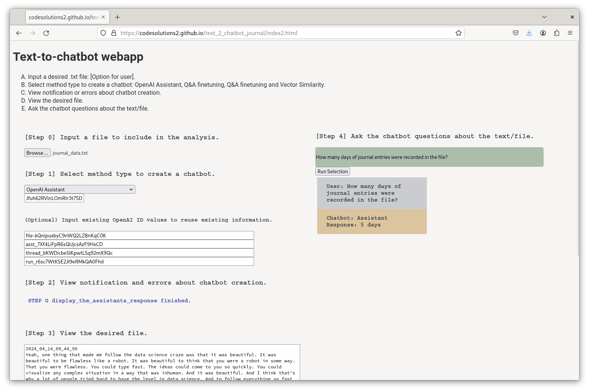

# text_2_chatbot_journal

The intention of this application is to demonstrate a Productivity application for better everyday responsible self-help. Being active in life means that one is taking action, and learning by reflecting on the responses in their life due to their activity. By recording or writing ideas in a journal, self-discovery and better decision making can be fostered to have a "Happy and Healthy Life". The purpose of this webapp is to create a **chat-bot personal journal** or **digital twin**, compiling both audio and text, such that better self-awareness and responsibility can be acheived. 

Chat-bot technology used in a self-transformative manner can be the start of a new type of self-therapy that perhaps could be used to help people to:
1. better solve their problems,
2. be less violent with themselves and others,
3. have more self-respect and respect for others,
4. be more responsible such that everyone can have a positive future,
5. and live a happier and healthier life.

Input text data and/or other data into a journal, train a chatbot with the journal data, ask the chatbot questions about the journal data for better self understanding.

[**Upload your data to the FrontEnd App Here**] https://codesolutions2.github.io/text_2_chatbot_journal/index2.html

